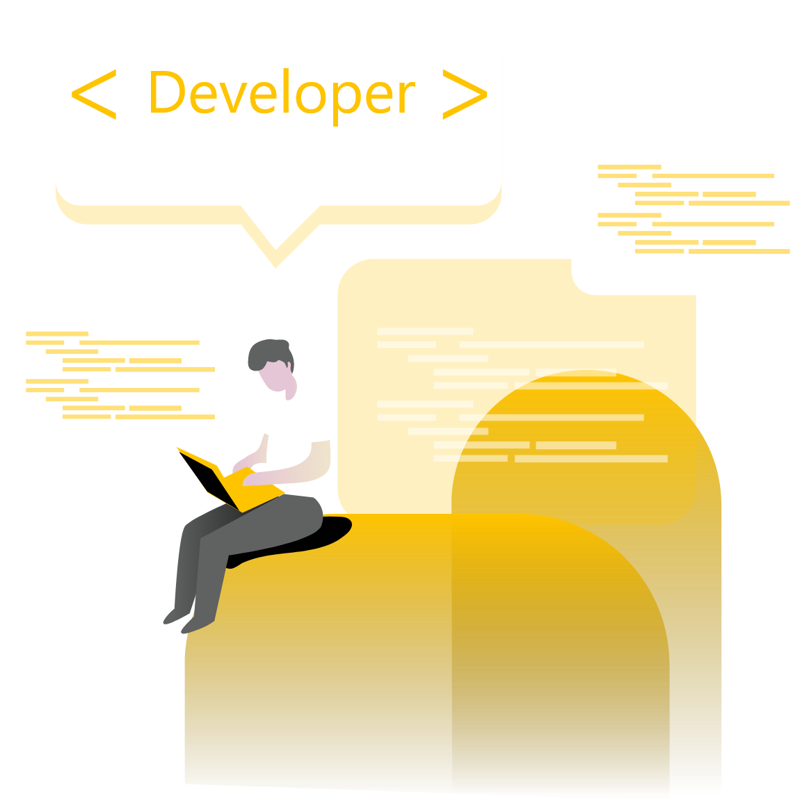

<h1 align="center">
  
</h1>

<h4 align="center">
  My personal portfolio
</h4>

<p align="center">
  

  

  <a href="https://github.com/lineuxyz/my-portfolio-project/stargazers">
    
  </a>

  <a href="https://github.com/lineuxyz/my-portfolio-project/network/members">
    
  </a>

  <a href="https://www.linkedin.com/in/lineu-pastorelli-5165a7186">
    
  </a>
</p>

## 📚 The Project

This is a project that develops as my personal portfolio, showing my contacts, recent projects that I did, and brief descriptionabout who I am.

<h1 align="center">
  
</h1>

## 🖥 Technologies

This project was developed with the following technologies:

* [React](https://reactjs.org/docs/getting-started.html)
* [Gatsby](https://www.gatsbyjs.org/docs/)
* [Styled-components](https://styled-components.com/docs)
* [Polished](https://polished.js.org/docs/)
* [Material-icons](https://material-ui.com/components/icons/)

## 🔖 Layout
  This layout will be in [Figma](https://www.figma.com), it will be possible to see it there. [Click here]() to see.

## ❓ How To Use

To clone and run this application, you'll need [Git](https://git-scm.com), [Node.js](https://nodejs.org/en/) and [Yarn](https://classic.yarnpkg.com/en/docs/install/) installed on your computer.

From your command line:

### Clone the project
 ```bash
 # Clone this repository
 $ git clone https://github.com/lineuxyz/my-portfolio-project

 # Go into the repository
 $ cd my-portfolio-project

 # Install dependencies
 $ yarn install or npm install

 # Run project
 $ yarn start or npm start
```

## 🤔 How to contribute

* Make a fork;
* Create a branch with your feature: `git checkout -b my-feature`;
* Commit changes: `git commit -m "feat: My new feature"`;
* Make a push to your branch: `git push origin my-feature`.

After merging your receipt request to done, you can delete a branch  for yours.

## 📜 License

This project is under the MIT License. See the [LICENSE](LICENSE.md) for details.

---

Made with ❤️ by [Lineu Pastorelli](https://www.linkedin.com/in/lineu-pastorelli-5165a7186)
